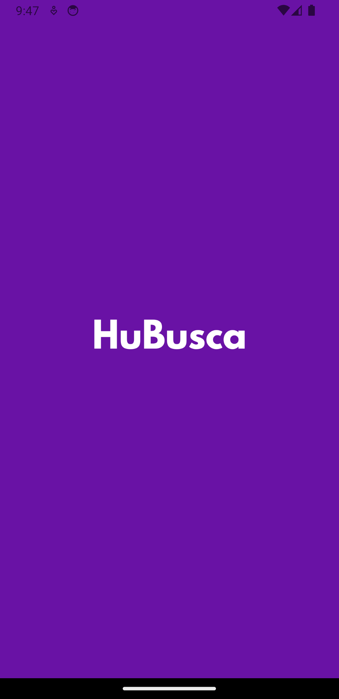

# Nome do Projeto

- **HuBusca**

## Descrição

- **Hubusca** é um aplicativo mobile construído com tecnologias modernas para proporcionar uma experiência incrível aos usuários. O aplicativo permite que os usuários explorem repositórios do GitHub, vejam detalhes dos usuários, acessem histórico de pesquisas e muito mais.

## Capturas de Tela

<details>
  <summary>Clique para ver as capturas de tela</summary>
  
   ### Captura de Tela 1:
  
  <br>

### Captura de Tela 2:

  
  <br>
  
  ### Captura de Tela 3:
  
  <br>
  
  ### Captura de Tela 4:
  
  <br>
  
  ### Captura de Tela 5:
  
  <br>
  
  ### Captura de Tela 6:
  
  <br>
</details>

## Funcionalidades Principais

- Exploração de Repositórios: Os usuários podem explorar uma ampla gama de repositórios do GitHub, visualizar detalhes e estatísticas.
- Perfil de Usuário: Visualize informações detalhadas sobre os usuários, incluindo dados de perfil, seguidores, repositórios públicos e muito mais.
- Histórico de Pesquisas: Mantenha um histórico das pesquisas realizadas, facilitando o acesso a repositórios e usuários anteriores.
- Integração com API GitHub: O aplicativo utiliza a API do GitHub para buscar informações atualizadas sobre repositórios e usuários.

## Instalação e Execução

### Clone este repositório:

```bash
git clone git@github.com:FranciscoVieir/clicksoft-teste.git
```

### Acesse a pasta

```bash
cd clicksoft-teste
```

## Instale as dependências:

```bash
npm install
```

#### ou

```bash
yarn start
```

## Tecnologias Utilizadas

- React Native
- Axios
- React Navigation
- Styled Components
- React Native Vector Icons
- Typescript
